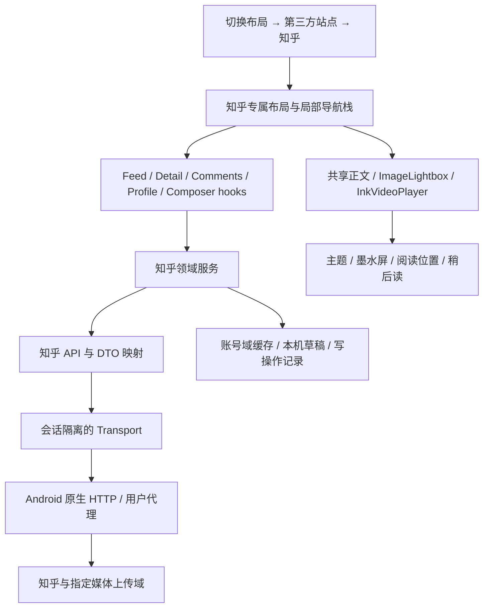

# 知乎完整站点适配：源码分析与设计方案

日期：2026-09-15。状态：设计提案，尚未实施。参考对象：本地 `third-party/zhihu-plus-plus-master` 快照。

**用户已明确的入口与布局约束：** 在“切换布局 → 第三方站点”中新增“知乎”，选中后直接进入为知乎建立的完整自定义布局 UI。它不是首页信源、分类或普通新闻列表入口。以下设计以此为准。

## 1. 结论与边界

建议在 NewsNook 内实现独立的知乎站点工作区：React 页面承载信息流、问题、回答、评论、个人与创作；站点服务封装知乎协议；Android 使用原生网络和独立站点会话；复用 NewsNook 的主题、媒体、离线阅读与返回机制。

这项能力超出现有新闻源的列表与正文解析。`kind: 'zhihu'` 目前表示知乎日报，不得复用其含义承载知乎社区。现有 `web-catalog` 适配器也不能表达账号、互动和创作。

**本轮交付是源码分析和设计实施方案，不包含功能代码，也没有登录知乎、发送评论或发布内容。** 下文“已找到”表示有本地源码证据，不代表接口于今日实测可用。“待验证”必须成为交付门槛，不能通过隐藏按钮就算完整。

### 与现有规则的关系

- 用户此次明确要求推荐、编辑、发布等完整站点能力。这是对现有“新闻阅读工具、不引入推荐算法”范围的具体扩展：推荐仅在用户主动进入的知乎工作区内存在，标注来源；不改变“速闻”排序，不向 NewsNook 全局阅读画像添加知乎行为。
- 默认推荐入口提供知乎上游推荐；参考项目的本地与混合模式列入完整对齐范围，但独立开关、独立数据域、不后台自动启用采集任务。
- 未登录 NewsNook Cloud 仍可用知乎；未登录知乎仍可阅读已缓存正文、管理本地草稿，并尝试上游允许的公开浏览。不能承诺上游对匿名请求始终开放。
- 完整原生能力的验收平台是 Android `cloud` 与 `local` 两个变体。Web 的完整认证交互受浏览器限制，见第 6 节；不能宣称普通浏览器与 Android 已天然等价。
- 业务内容的权威状态来自知乎，编辑过程和恢复数据优先落本机；离线不伪装发布成功。知乎会话、草稿、私信、关系数据不进入 NewsNook Cloud 同步。

## 2. 参考项目如何实现

以下路径均相对于 `third-party/zhihu-plus-plus-master/shared/src/commonMain/kotlin/com/github/zly2006/zhihu/`，Android 平台实现另行标明。

### 2.1 技术形态与调用链

参考项目已采用 Kotlin Multiplatform：共享层包含 Compose UI、ViewModel、模型、Ktor 网络与协议；平台层提供网络引擎、登录 UI、本地持久化和媒体能力。不是把知乎网页整体嵌入 WebView 就获得全部功能。

典型路径：`Compose 页面 → ViewModel/Environment → Ktor 请求与签名 → 知乎 Web/移动 API → DTO/展示模型 → 分页和详情状态`。

| 领域 | 核心源码证据 | 实现要点 |
|---|---|---|
| 会话与多账号 | `account/ZhihuAccountRepository.kt`、`ZhihuAccountClient.kt` | 保存账号槽位、当前账号、Cookie、UA、profile、移动 access/refresh token；账号经服务端资料校验 |
| 登录 | `account/QrLogin.kt`、`ZhihuPhoneLoginClient.kt`；`shared/src/androidMain/.../account/AndroidLoginUi.kt` | 扫码创建/轮询、短信/验证码流程、平台登录 UI；登录成功后验证本人资料 |
| 网络与认证 | `data/ZhihuApiClients.kt`、`ZhihuDataTypes.kt`、`util/ZhihuFetchSignature.kt`、`ZhihuCredentialRefresher.kt` | Cookie 存储、Web 请求签名、写操作 CSRF、401 刷新；移动与网页请求上下文不同 |
| 普通/移动信息流 | `viewmodel/feed/HomeFeedViewModel.kt`、`viewmodel/za/AndroidHomeFeedViewModel.kt` | 分页、异构卡片解码、前台快速过滤、后台补充过滤、阅读交互上报 |
| 混合推荐 | `viewmodel/za/MixedHomeFeedViewModel.kt` | 并发调用两个 feed ViewModel，共享展示列表；迁移时应显式合并结果，避免共享可变数组 |
| 本地推荐 | `viewmodel/local/LocalRecommendationEngine.kt`、`FeedGenerator.kt`、`UserBehaviorAnalyzer.kt`、`TaskScheduler.kt` | 本地候选库、抓取任务、行为画像、候选排序、推荐理由多样性与反馈；远不止“拉一个推荐接口” |
| 问题与回答 | `viewmodel/feed/QuestionFeedViewModel.kt`、`viewmodel/ArticleViewModel.kt`、`navigation/AnswerNavigator.kt` | 问题回答列表/排序/关注；正文、关系、投票、收藏；回答切换保存来源列表上下文 |
| 评论 | `viewmodel/comment/{RootCommentViewModel,ChildCommentViewModel,BaseCommentViewModel}.kt` | 根评论、子评论、排序、定位、段落评论、发送/回复、点赞/取消、按权限删除 |
| 创作 | `ui/WriteAnswerScreen.kt`、`ui/WritePinScreen.kt`、`editor/ZhihuAnswerPublisher.kt`、`ZhihuPinPublisher.kt` | Markdown 编辑和预览；回答草稿与发布；想法草稿、话题与发布 |
| 内容转换/上传 | `editor/ZhihuMarkdownCompiler.kt`、`ZhihuImageUpload.kt` | 编译知乎 HTML；申请图片上传凭据、上传文件、轮询图片处理状态，GIF 有分片路径 |
| 个人 | `ui/PeopleScreen.kt` | 个人资料、回答/文章/动态/想法/提问、关注与粉丝、收藏/专栏/话题、关注与屏蔽 |
| 收藏 | `viewmodel/CollectionsViewModel.kt`、`CollectionContentViewModel.kt`、`ArticleViewModel.kt` | 收藏夹列表/详情、创建/删除、内容添加与移除、收藏夹内阅读 |
| 搜索与话题 | `viewmodel/feed/SearchViewModel.kt`、`ui/SearchScreen.kt`、`TopicScreen.kt` | 综合和分类搜索、过滤、限定用户搜索、话题及关注 |
| 通知与私信 | `viewmodel/NotificationViewModel.kt`、`ui/PrivateMessageScreen.kt` | 通知时间线、标记已读、会话列表、会话翻页、发送私信 |
| 视频 | `data/ZhihuDataTypes.kt` 的 `fetchHighestQualityZhihuVideoUrl` | 通过视频标识及内容上下文获取播放信息；不是把正文 HTML 中的地址直接视为永久播放源 |

### 2.2 已核实的协议样本

这些是本地代码里出现的调用，不是官方稳定 API 承诺。保留路径级证据；签名实现与真实凭据不写进此文档。

| 动作 | 源码中的请求路径/机制 | 备注 |
|---|---|---|
| 首页推荐 | `api.zhihu.com/topstory/recommend` | 当前 `HomeFeedViewModel` 和移动 ViewModel 都使用此路径；前者旧 Web URL 只是注释。模式名称不能用来推断实际 endpoint |
| 热榜 | `GET /api/v3/feed/topstory/hot-lists/total` | `HotListViewModel.kt`；在知乎工作区独立展示上游热榜 |
| 关注相关候选 | `api.zhihu.com/moments_v3?feed_type=recommend` | 本地推荐辅助函数存在；具体关注流语义需用返回样本确认 |
| 问题回答 | `zhihuQuestionFeedsUrl(questionId, limit, order)` | 问题页以排序和分页游标组织答案 |
| 点赞回答/文章 | `POST /api/v4/{answers|articles}/{id}/voters` | 需核实请求中投票状态与取消/反对语义，不能统一按布尔点赞处理 |
| 根/子评论 | `/api/v4/comment_v5/{type}/{id}/root_comment`、`/comment/{id}/child_comment` | 问题、回答、文章、想法都有不同目标上下文 |
| 发评论/回复 | `POST .../{type}/{id}/comment` | 回复携带目标评论；段落评论还需要段落/选区位置 |
| 点赞/删除评论 | `POST/DELETE /api/v4/comments/{id}/like`；`DELETE /api/v4/comment_v5/comment/{id}` | 删除不是“删列表元素”而已，源码同步调整父评论计数和映射 |
| 回答草稿 | `POST /api/v4/questions/{id}/draft` | 数据类名叫 `PatchDraftRequest`，真实调用是 POST，不能凭类型名推断为 PATCH |
| 发布/编辑回答 | `POST /api/v4/content/publish` | 先查本人已有回答，再保存草稿；`isPublished/contentId` 区分新建和编辑 |
| 想法草稿 | `POST api.zhihu.com/content/drafts` | 已找到保存入口，不等于草稿箱列表/恢复/删除完整存在 |
| 图片 | `POST api.zhihu.com/images` → 上传域 → `GET .../images/{id}` | 上传凭据和知乎登录凭据分域使用；处理成功后才插入远端资源 |
| 视频 | `POST /api/v4/video/play_info` | 结合 videoId、contentId、contentType 取源；播放源要处理过期 |
| 个人内容 | `/api/v4/members/{token}/answers`、`articles` 等 | id 与 urlToken 都存在，不能拿昵称当主键 |
| 收藏夹 | `/api/v4/collections`、`/api/v4/collections/{id}`、`api.zhihu.com/collections/contents/{type}/{id}` | 创建、删除和内容增减已有证据；编辑夹名/描述需补证 |
| 通知/私信 | `api.zhihu.com/notifications/v3/timeline/entry`、`/messages`、`/messages/user` | 身份私有数据，不允许共享缓存 |

### 2.3 不能直接照搬的地方

1. **完整 CRUD 尚有缺口。** 本轮对共享 UI/ViewModel/editor/navigation 的搜索未定位到完整草稿箱管理、文章创作、问题创建编辑、本人资料修改、回答/文章删除等闭环；不能以“没搜到”断言全仓永远不存在，也不能把它们列为已有实现。
2. **编辑存在转换风险。** 回答编辑会把 `editableContent/content` 转成 Markdown。复杂卡片、公式、视频、表格及平台属性往返可能丢失。NewsNook 完整编辑应保存结构化文档和原始块，不能无提示降级为纯文本。
3. **UI 内混有业务操作。** `WriteAnswerScreen` 自己执行保存、发布和错误处理，`PeopleScreen` 包含多组请求。迁移时把这些放在 feature service，页面只消费状态。
4. **请求重试不可照抄。** 参考通用认证请求遇 401 会刷新后再请求；NewsNook 必须根据操作是否安全重试区分读与写，特别是发布、评论和私信。
5. **Cookie 不能是任意 host 共用字符串。** 参考存储较简化；目标实现按域、路径、有效期、账号管理 Cookie，重定向重新检查，上传域绝不收到知乎会话。
6. **许可证不同。** 参考文件头声明 AGPL-3.0-only，NewsNook 根 LICENSE 为 Apache-2.0。默认只参考协议事实、交互和行为后自行实现，不直接搬运 Kotlin/Rust/JS 源码或素材；如后续决定复用代码，先单独核对其授权及分发安排。本轮未复制第三方实现。
7. **附加系统不等于站点基础能力。** AIGC 投票服务、独立升级器、模型下载、参考项目遥测等不进入 NewsNook 的知乎适配。

## 3. “完整功能”验收范围

CRUD 按实体和上游支持的操作定义，不给所有实体套一个通用 `create/update/delete`。例如评论如果上游不支持编辑，应准确给出不支持的结论；不能偷偷用删后重发替代。

状态：A＝找到实现入口；B＝只找到部分闭环；C＝需要补齐协议证据。所有 A 仍需真实联调。

| ID | 能力与完成标准 | 参考状态 |
|---|---|---|
| Z01 | 登录、退出、会话恢复、过期/验证处理、多账号切换；切换后无上一账号数据闪现 | A |
| Z02 | 推荐/关注/热榜、刷新/翻页/去重/重试、异构卡片；保留上游顺序和来源 | A/B，关注流语义需补证 |
| Z03 | Web/移动/混合/本地四模式；各自游标和缓存；本地模式解释理由、可清空画像 | A；目标实现独立可关闭 |
| Z04 | 综合及分类搜索、排序筛选、话题页、专栏入口、作者内搜索 | A/B，逐分类验收 |
| Z05 | 问题详情、回答分页排序、关注、写回答；同题及来源列表切换、返回原位 | A |
| Z06 | 回答/文章/想法全文，作者与关系状态，图片、公式、表格、视频，站内链接跳转 | A；复杂块兼容需样本 |
| Z07 | 赞同/反对/取消、收藏/取消、关注/取消/屏蔽；同实体所有页面一致更新 | A/B，按资源分别核对 |
| Z08 | 根评论/楼中楼/热度与时间排序/锚点、发送/回复/赞/取消/权限删除、段落评论 | A；评论编辑能力 C |
| Z09 | 个人主页、资料展开、动态/回答/文章/想法/提问、关注/粉丝、专栏/话题 | A |
| Z10 | 收藏夹列表、创建/读取/改名与描述/隐私/删除、增减内容、关注收藏夹 | B；更新和隐私变更 C |
| Z11 | 本机草稿箱与知乎草稿箱、创建/读取/恢复/更新/删除、按目标与账号隔离、离线与杀进程恢复 | B；远端列表/读取/删除 C |
| Z12 | 回答新建、编辑、预览、保存草稿、发布、本人内容删除；发布后读回校验 | B；删除 C |
| Z13 | 文章与想法的创作/编辑/发布/管理；提问与问题编辑按上游权限支持 | 想法 B；文章创作/问题写入 C |
| Z14 | 图片上传、失败恢复、资源替换、原始格式保留；视频上传/发布若属于对应内容类型则补齐 | 图片 A；视频上传 C |
| Z15 | 站点个人中心：本人资料编辑、作品管理、草稿、收藏、账号设置 | 浏览 A；资料修改 C |
| Z16 | 通知分类/未读/全部已读/定位，私信会话/收发/分页；本地输入恢复 | A/B；删除会话等单独验证 |
| Z17 | 本地已读、稍后读、缓存正文、阅读位置、搜索、分享；站点历史与本地历史区分 | 复用 NewsNook 并验收桥接 |
| Z18 | 全局配色/字号/明暗/自定义主题、墨水屏、无障碍、键盘/返回栈、两变体 | 目标端必须新增集成验收 |

**完整发布判据：** Z01–Z18 的适用动作全部具备真实协议闭环与验收记录。C 项先做协议验证，不能假造 endpoint。若上游不提供某动作，记录证据和明确的产品处理，不能把“待实现”改成“不支持”来减少范围。

## 4. NewsNook 的现有接入点

| 现有文件 | 现状 | 设计决定 |
|---|---|---|
| `src/sources/registry.ts`、`registry/model.ts`、`builtinSources.ts` | 聚合入口；`zhihu-daily` 对应 `kind: 'zhihu'` | 保持含义；增加独立站点静态描述，由 registry 导出，源和站点入口区分 |
| `src/lib/parseFeed/zhihu.ts` | 知乎日报 JSON | 保持现有解析，社区 DTO 放新 feature |
| `src/features/comments/types.ts` | 只读 `CommentProvider`；没有作者 id、关系与 mutation | 保留兼容；知乎交互评论单独模型，按实际复用需求提供只读投影 |
| `src/components/PresetSwitcher.tsx` | 当前代码文案为“切换场景预设”，有站点入口；对应用户所指的切换布局入口 | 在“第三方站点”分组中直接增加“知乎”选项，选中立即切换专属布局 |
| `src/App.tsx`、`src/screens/SiteScreen.tsx` | 已有 `sites` 分支，当前来自 `frameworkHint/web-catalog` | App 按所选站点挂载专属工作区；CMS 继续使用 SiteScreen，知乎直接挂载 ZhihuWorkspace，不经过通用站点目录页 |
| `src/components/TabBar.tsx` | 类型含 `sites`，底栏实际显示“速闻/我的” | 普通阅读布局保留原底栏；知乎布局使用自己的导航，不叠加普通阅读底栏；切换入口不依赖自建 CMS 数量 |
| `src/screens/ReaderScreen.tsx` | 新闻 Article 输入，正文生命周期和媒体能力较多 | 提取实际共用的正文/媒体组合；只读内容桥接 Article，社交状态留在知乎 feature |
| `src/components/ImageLightbox.tsx` | 捏合/平移/双击、长按保存/分享、overlayCloserRef | 直接复用，单图接口保持兼容；图库外围管理当前图片 |
| `src/components/InkVideoPlayer.tsx` | `src/format/sourcePage/requestHeaders/resources`，全屏句柄、过期刷新回调 | 复用播放器；知乎适配只负责授权取源和描述资源 |
| `src/components/InlineArticleVideos.tsx` | 对正文占位符 portal 挂播放器 | 复用挂载机制与 Wi-Fi 策略，先核对描述符格式 |
| `src/lib/http.ts` | 新闻 GET/表单 POST、native/proxy、文本解码与降级 | 可共享底层网络；独立认证请求 API，禁止写请求走新闻正文降级链 |
| `android/.../ProxiedHttpPlugin.java` | 已能处理 POST/PUT/PATCH/DELETE | 优先复用能力，不另造隧道；补会话、二进制/取消等实测所需缺口 |
| `src/features/account/secureStore.ts` | Android Keystore；Web 为内存 | 复用底层实现并独立 key 前缀，不复用 NewsNook 账号 token/schema |
| `src/index.css`、`src/lib/theme.ts` | `ink/paper/cinnabar/haze` 等语义 token，明暗与 scheme | 全部界面沿用 token，不引入知乎蓝固定配色或第二套主题 |
| `src/lib/bodyCache.ts`、`readingPosition.ts`、`backup.ts`、`features/sync/projection.ts` | 正文约 3MB、明确同步/备份边界 | 公共正文复用；私有数据单独账号域；草稿不可放正文 LRU，默认不进备份/同步 |

关于“图片分析”：本轮在 `ImageLightbox` 确认的是查看、缩放、保存、分享，未确认独立图片分析公开接口。实现阶段若需要接现有 AI 能力，应定位实际入口后接入，不能虚构 `onAnalyze` 已存在。

## 5. 架构方案



### 5.1 目录与职责

```text
src/sources/registry/sites.ts           静态站点描述、origin、适配器 id；从 registry.ts 导出
src/features/sites/types.ts            只定义 SiteDescriptor / 工作区宿主契约
src/features/zhihu/
  types.ts                            内容实体、ID、权限、分页、操作结果
  runtime.ts                          注入 transport/storage；创建账号作用域服务
  navigation.ts                       局部 route reducer、页面恢复状态
  api/{client,endpoints,decode}.ts     请求、版本化端点、DTO 校验与映射
  session/{service,store,types}.ts     登录/校验/切换；站点安全存储
  transport/{types,android,web}.ts     平台网络；Web 明确能力状态
  feed/{service,useZhihuFeed,rank}.ts  流、分页/竞态、本地可选排序
  content/{service,normalize,links}.ts 正文、结构化块、站内 URL
  comments/{service,types,useComments}.ts
  people/service.ts                   个人、关系、作品与资料修改
  collections/service.ts              收藏夹与成员操作
  notifications/service.ts            通知、私信与已读
  editor/{schema,codec,service}.ts     编辑文档、HTML 往返、保存发布
  editor/{draftStore,upload}.ts        本机草稿、资源生命周期
  storage/{database,cache,operations}.ts 本地事务、缓存、未知写入结果
  bridge.ts                           公共内容与 NewsNook Article 互转
  ui/                                 工作区、页面与领域组件
```

不搭通用社交平台大框架、不给 RSS 强加 CRUD。只共享有明确第二个调用方的宿主/网络/媒体能力。第一站点用具体服务，小而稳定的注入契约用于测试和替换网络。

### 5.2 数据模型

- `ZhihuEntityRef = { kind, id }`，kind 至少区分 question/answer/article/pin/people/collection/comment。所有上游 ID 用字符串，避免大整数精度损失。
- `FeedEntry` 保存事件/卡片标识、推荐理由、内容引用、时间与来源；内容实体独立。展示去重可按内容引用，原始事件保留用于解释来源。
- `Page<T> = { items: T[]; nextCursor?: string; hasMore: boolean }`；cursor 由 adapter 解释，不暴露给 UI 作为可任意请求 URL。next URL 必须经过协议及域白名单验证。
- 内容含 `permissions`，分别表明读、评论、编辑、删除等动作的允许/禁止/未知；不能仅用“已登录”推导可删除。
- 关系状态以 `(accountId, kind, id)` 为键；公共内容与私有关系分开，防止账号切换串缓存。
- 领域实体键可用 `answer:123`，但接入稍后读等功能的公开正文映射为 `Article` 后，必须沿用 `feedArticleId(sourceId, canonicalUrl)`，不能直接把领域键当 Article.id，否则分享接收端会算出不同 id。sourceId 使用独立注册的 `zhihu-community`，canonicalUrl 统一规范化；问题/用户/评论不强转 Article，不借用 `neteaseDocId`。
- 公共阅读投影在 `registry/model.ts`/`builtinSources.ts` 增加独立 `zhihu-community` kind/source，由 registry 聚合导出，供 `findSource`、正文解析和分享接收端识别；不复用日报 kind。站点私有流不进入全局普通源刷新；只读投影的调度边界必须显式处理，不能让未知 kind 落到通用 RSS 分支。
- 收藏至知乎与 NewsNook“稍后读”是两个动作。前者依赖知乎确认，后者立即本机生效。
- 评论模型保存 rootId、replyToId、authorId、liked、canDelete、childCount、segmentAnchor；不能使用现有 `quotes` 冒充可分页楼中楼。

### 5.3 网络与会话

协议客户端按 endpoint 指定 Web/移动认证上下文、请求类型、可重试性和错误解析器。序列化一次再签名并发送同一份 bytes；禁止签名与实际 JSON 序列化不一致。签名算法的兼容性放在独立测试向量验证，不散布进 UI。

安全存储键使用 `site.zhihu.<accountId>.*`，不使用会被 NewsNook Secret 投影扫描的前缀。JS UI 只持有会话状态/账号摘要；原生可执行的认证尽量在桥接边界处理。禁止把 Cookie 放到 `NewsSource.requestHeaders` 或自建源可导出的偏好里。

会话状态：`guest → authenticating → authenticated → expired / verification-required`。扫码/站内登录作为首批路径，短信和已有移动凭据路径按协议门槛补齐。原生受控登录 WebView 只承担登录及必要验证，不承担核心业务页面；关闭后先验证本人资料才设置已登录。

认证拦截只允许精准知乎 host；媒体域、上传域分开管理。登录 WebView 的 Cookie 和 HTTP 客户端 Cookie 需要显式建立同步与账号切换流程。内置 Capacitor Cookies 提供 native Cookie API，但不会自动证明两个独立 WebView/HTTP Cookie jar 已隔离和同步，必须用设备测试验证。[Capacitor v8 文档](https://capacitorjs.com/docs/apis/cookies)

账号切换：flush 本机草稿 → 取消可取消请求 → session generation 加一 → 卸载旧工作区状态 → 安装新会话 → 重建关系/私有缓存视图。原生请求不能取消时，旧 generation 响应不得写回。发布中不允许无声换号，等待确定结果或先标记未知结果。

错误分类为 auth-expired、verification-required、forbidden、rate-limited、network、invalid-response、conflict、unsupported。403 不一概当作 token 过期；429 按上游提示退避；风控回到用户验证路径。

### 5.4 写操作和草稿可靠性

- 赞、关注等可逆动作可乐观展示，记录上次确认状态；按实体串行合并目标状态，失败回滚并保留错误提示。不能“每点一次发一次 toggle”造成乱序。
- 评论、私信、发布、删除按确认结果更新。不在网络异常后盲目重发非幂等操作。
- 本地操作记录包含操作 id、账号、目标、内容摘要和 `pending/confirmed/failed/unknown`。这是站点本地日志，不复用 Cloud Sync Outbox；本地 operationId 不等于知乎支持幂等键。
- 发布超时：保留草稿与资源，标记“正在确认发布结果”；读取本人内容/目标回答核对；不能确认时保留 unknown，让用户选择，禁止后台补发。
- 草稿以账号 + 内容类型 + 目标 id/本地草稿 UUID 隔离，保留 localRevision、remoteDraftId、remoteRevision（上游提供时）、baseHash、updatedAt、document、上传资源引用。
- 本机草稿使用独立 IndexedDB 事务存储和 Blob store；不占用正文 localStorage LRU。Android WebView 杀进程恢复、磁盘满、升级迁移和存储持久性都要实测；不宣称系统清数据/卸载后仍保存。
- 输入合成期间不上传；建议停止输入 500ms 后落本机、切后台/返回前 flush。UI 只有收到落盘确认才显示“已保存”；进程在保存前被强杀存在窗口，不虚假承诺零丢字。
- 远端自动存草稿需明确启用，建议 2s 去抖及单草稿串行；响应按 revision 接受。多设备无版本字段时用基线 hash 检测差异并保留副本，明确无法提供上游不存在的原子 CAS 保证。
- 清缓存不清草稿；退出/换号不删除草稿；删除账号前展示本机草稿数量及保留/导出选项。草稿导出与现有配置备份独立，默认排除私信和站点凭据。

### 5.5 完整编辑器

建议使用能保留结构化文档的 headless 编辑器，候选为 Tiptap/ProseMirror，界面完全使用 NewsNook 组件与 token；它提供可扩展编辑基础，不能替代知乎格式适配。[Tiptap 官方概览](https://tiptap.dev/docs/editor/getting-started/overview)

这会新增生产依赖，原因是需要可靠的中文输入、撤销重做、复杂文档选择区与块级 schema。当前没有安装任何依赖；进入实现时锁定经 React 19/Android WebView 验证的具体包及版本、核对体积与许可，按块最小引入。

文档节点覆盖段落、标题、加粗/斜体/删除线、引用、列表、分隔线、链接、代码、图片/说明、公式、表格、视频引用、知乎内容卡片、话题。未知块保留原始表示为不可直接编辑块，支持保留或显式删除，不静默清洗丢失。

读取：`editable HTML → codec → EditorDocument`；发布：`EditorDocument → 知乎合法 HTML → 请求快照`。阅读 sanitize 和编辑保存 codec 分离：展示安全清洗不能覆盖原始编辑数据。Markdown 可作为新内容输入/导入模式，切换可能丢失格式时要求明确提示，不能当作所有旧内容的唯一真相。

上传队列记录 hash/localBlobId/remoteId/state，成功后更新块引用；未完成上传时禁用发布并说明哪张图未完成。大文件走原生文件引用/流式上传，避免把整段视频 Base64 经 JS 桥接；视频发布协议未证实前不做假上传入口。

### 5.6 媒体和阅读复用

1. 先把回答/文章 HTML 转成 NewsNook 可渲染的块和媒体描述，处理懒加载图、动图、卡片、公式、视频 id、内部链接。
2. 页面统一调用 `ImageLightbox`；图片区顺序由外层 gallery 状态维护。保存/分享走已有 imageActions，不另写平台逻辑。
3. 播放信息解析为现有 `MediaResourceDescriptor`，交给 `InkVideoPlayer`。只透传该媒体请求确实需要的 headers；不能给所有视频分片发送完整知乎 Cookie。
4. 接入 `onRefreshSource` 重新解析过期播放源，保留合理的播放位置；媒体失败保留正文，不让整篇回答变错误页。
5. 全屏句柄、overlayCloserRef、正文滚动锁统一注册到宿主；返回先关顶层浮层/全屏，再退出内容页。
6. 公共正文共享正文缓存、翻译、阅读位置和稍后读；私密/付费授权内容不落公共池，也不借站点适配突破访问权限。离线视频另需用户显式下载范围，复用播放器不等于已实现下载。
7. 从 ReaderScreen 提取共用正文组合必须保留原新闻阅读回归测试；不要拷贝整个近两千行页面或把社区所有逻辑塞回该页面。

## 6. Android 与 Web 的能力边界

浏览器脚本不能自由设置 Cookie 等受限请求头，并受跨域与凭据策略控制。NewsNook 域名无法读取知乎域的 HttpOnly 会话。[WHATWG Fetch 标准](https://fetch.spec.whatwg.org/#forbidden-request-header)

| 执行环境 | 可行设计 | 完整性判断 |
|---|---|---|
| Android 两变体 | 原生会话/HTTP + 受控登录页面；业务 React 渲染 | 本方案完整原生能力的主验收面 |
| Web 无桥接 | 本地草稿、已缓存阅读、已有安全公共代理允许的匿名读取 | 明确能力受限，不能宣称登录 CRUD 完成 |
| Web + 用户侧桥接 | 单独开发浏览器扩展或本地 companion，在用户设备完成认证网络，UI 仍在 NewsNook | 若要求 Web 同等完整，这是独立工作包和交付门槛 |
| 公共托管凭据中转 | 平台代持 Cookie、转发写入 | 不作为默认方案，会改变信任、隐私和部署边界 |

现有 `functions/api/[[path]].ts` 与 Vite 代理服务新闻读取/有限 POST，并不是知乎认证 CRUD 网关。不得通过“给通用代理多放几个 header”传输所有用户 Cookie。

若后续明确要求完整 Web：推荐 companion/扩展通信使用精确 NewsNook origin 白名单、用户配对、短期会话、操作白名单、无任意 URL 请求；完成后分别验收浏览器更新、连接断开、重连、取消配对。此决策不能靠普通 CORS 配置解决。

## 7. 信息架构与视觉方案

### 7.1 入口

唯一主入口是“切换布局 → 第三方站点 → 知乎”。直接在布局选择器的第三方站点分组中增加知乎选项，选中关闭选择器并挂载 `ZhihuWorkspace`。不先进入通用站点目录页，不落回首页信源列表或分类页；没有任何 `frameworkHint` 自建站点时，知乎选项也必须可见。知乎日报继续作为原有独立订阅源。

知乎布局自主拥有顶栏、主导航、信息流卡片、问题/回答页、评论区、编辑器与个人中心。建议移动端主导航为“首页 / 消息 / 我的”，首页内“关注 / 推荐 / 热榜”；搜索位于顶栏，创作从问题和站点个人中心进入。桌面使用知乎布局自己的侧栏。普通阅读布局的“速闻 / 我的”、新闻分类条和信源筛选器不在知乎布局内叠加显示。

顶栏保留“切换布局”，当前名称显示“知乎”；可随时切换回普通阅读布局或其他第三方站点。登录只在用户进入需要身份的动作时引导，并保留待操作目标。

布局选择与新闻场景预设是两个状态维度：选择知乎只更新布局状态，不调用 `presets.applyPreset`，不修改原分类、启用信源和预设。离开知乎前保存编辑内容及页面上下文，回到阅读布局恢复原来的预设和位置；再次选择知乎恢复站点上下文。任何布局持久化新增键都应独立于现有预设格式，作为本机状态管理。

### 7.2 页面布局

| 页面 | 内容布局 | 交互重点 |
|---|---|---|
| 信息流 | 作者/推荐理由 → 标题 → 摘要 → 媒体 → 统计；图文与想法按内容类型呈现 | 下拉刷新、底部继续加载、屏蔽入口；不把新闻发布时间排序套上上游推荐 |
| 问题 | 标题、描述/话题、关注/写回答、排序、回答列表 | 返回保留排序、游标与滚动锚点；写回答前识别本人已有回答 |
| 回答/文章 | 作者及关系 → 正文 → 回答切换；底部紧凑的赞同/评论/收藏操作 | “稍后读”单独命名；媒体与墨水屏阅读动作优先 |
| 评论 | 移动端大抽屉，桌面侧栏；热度/时间切换，回复进入子线程 | 输入由页面外草稿服务持有；从作者页返回恢复评论锚点及输入 |
| 个人 | 头像/昵称/简介/关系/统计 + 内容分类 | 他人主页和本站点“我的”共享数据组件，不混入 NewsNook 账户设置 |
| 草稿箱 | 本机/知乎分区，类型筛选、更新时间、保存状态、失败/冲突标记 | 明确哪些只在本机、哪些已存知乎；不以网络空响应覆盖本机草稿 |
| 编辑器 | 顶部返回/保存状态/预览/发布；中间正文；键盘上方轻量格式工具栏 | 保存和发布分开；显示当前知乎账号；发布成功再清理草稿状态 |
| 通知/私信 | 分类与未读、会话与输入框 | 打开通知跳到站内实体/评论锚点；私信通知不泄漏正文至锁屏 |

### 7.3 主题、响应式与无障碍

- 使用现有 `bg-ink`、`text-paper`、`text-paper-muted`、`text-cinnabar`、`border-haze` 等语义类。名字不等于字面颜色，应跟随当前 scheme。知乎标识可保留品牌图形，主操作沿用全局强调色。
- 正文宽度跟随 NewsNook 阅读排版；桌面允许正文与评论并排，窄屏评论覆盖在正文上；不额外引入全局双层底栏。
- 按钮最小可触达区域建议 44px；焦点可见、aria 标签、未读和赞同不只靠颜色区分；键盘 Esc/返回与系统返回遵循同一栈。
- 墨水屏减少动画、禁 shimmer/自动播放、避免透明叠层影响对比；支持显式“加载更多”，分页阅读与输入光标滚动不得冲突。
- 测试 360/412px 窄屏及桌面，字号放大、中文输入法、软键盘 safe area、长昵称/长问题、离线/失败/空态。

### 7.4 返回栈

`ZhihuRoute` 为 feature 内 discriminated union，表示 feed/question/content/person/collection/editor/notifications/conversation。每个栈项独立保存 query、sort、cursor、anchor 和必要 selection；不把 Cookie、全文、巨大列表复制进 route。

系统返回按当前最上层可关闭对象处理：图片/播放器全屏或菜单 → 评论/格式弹层 → 编辑器（先保存）→ 工作区 route。到达知乎根页面后，返回恢复进入知乎前的布局及位置，不制造一个未访问过的通用站点目录页。顺序依据真实顶层对象，不能让两个 overlay 竞争同一 ref。多次打开同一目标应明确 push/replace 语义。

## 8. 分阶段交付与测试

完整范围固定，分阶段只是降低联调风险；前几阶段完成不叫“完整知乎”。详细任务见同日实施计划。

| 阶段 | 输出 | 必须证明 |
|---|---|---|
| P0 协议与样本 | Z01–Z18 操作证据矩阵、脱敏 fixtures、平台可行性与许可记录 | 区分已有/缺失/不支持；验证一条真实读取及草稿往返路径后再铺页面 |
| P1 宿主/会话/网络 | 站点入口、账号隔离、错误模型、原生网络 | 两变体登录/恢复/退出；不能影响 NewsNook Cloud 与匿名新闻阅读 |
| P2 浏览 | feed、搜索、问题/正文、个人/话题、媒体、Article 桥接 | 信息流顺序/翻页/返回锚点、站内全文、图片视频和离线 |
| P3 互动 | 评论/楼中楼、关系、收藏、通知/私信 | 真实读写读回、权限、乱序/失败回滚、跨页面一致性 |
| P4 创作 | 本机/远端草稿、复杂编辑、资源上传、发布更新与删除 | 断网/强杀恢复，复杂内容往返不丢块，发布超时不重复 |
| P5 对齐与收口 | 四种推荐模式、剩余 C 项、兼容与 UI 全矩阵 | Z01–Z18 所有适用项通过，公开列出上游限制与 Web 边界 |

测试分层：纯函数（DTO/codec/rank/route）→ 注入 transport 的服务行为测试 → 本机数据库生命周期 → Android 真机/模拟器交互 → 用户授权测试账号实网读写回归。

回归沿用已有脚本：`test:comments`、`test:resolve-body`、`test:reader-images`、`test:inline-video`、`test:video-gestures`、`test:native-fullscreen`、`test:theme`、`test:eink`、`test:share-link`、`test:config-backup`、`test:proxy`、账户/同步相关脚本；按实际改动选择。最终 `npm run lint`、`npm run build`，两 Android 变体构建与媒体/登录设备验证。

建议新增行为测试组：`test:zhihu-protocol`、`test:zhihu-session`、`test:zhihu-feed`、`test:zhihu-navigation`、`test:zhihu-comments`、`test:zhihu-editor`、`test:zhihu-drafts`、`test:zhihu-mutations`。这些脚本尚未创建，不是本轮运行结果。

## 9. 未验证事项与启动顺序

本轮完成源码定位、现有架构比对和设计；未运行第三方 App，未对登录/写入接口做线上验证，未测试签名今日是否可用，未安装编辑器或编译 APK。私有协议可用性、登录挑战、视频发布、草稿箱与其他 C 项是实质风险。

建议先做 P0 的“登录 → 获取本人资料 → 打开回答 → 取可编辑内容 → 保存独立测试草稿 → 读回”闭环，随后补齐缺失 CRUD 的协议证据，再进入完整 UI 实现。测试期间不自动发布公开内容、关注他人或发送私信；真实写入使用明确授权的测试目标。

设计完成不意味着接口和完整功能已经完成。最终成果应是能按 Z01–Z18 逐项验收的 Android 站点适配，包含已验证限制，而不是只有推荐流与回答阅读的演示。
